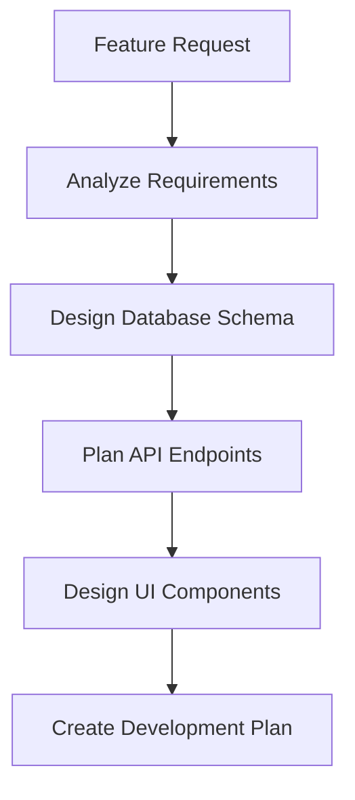
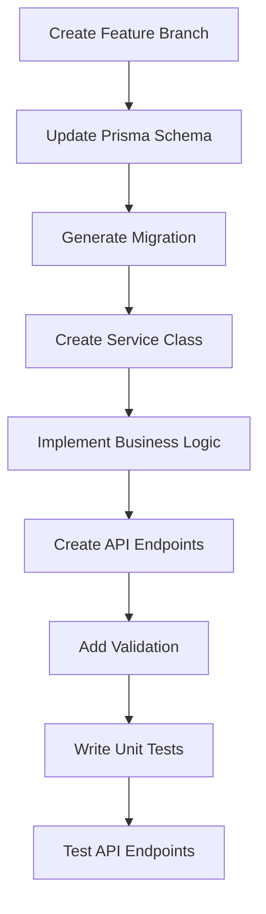
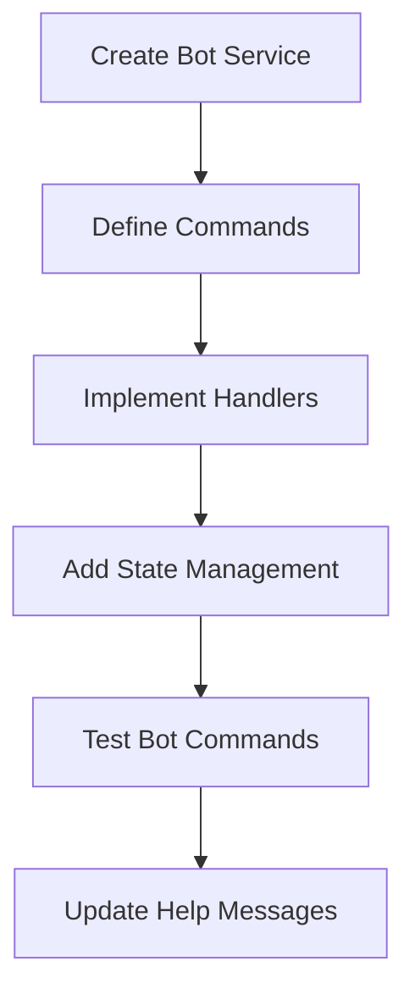
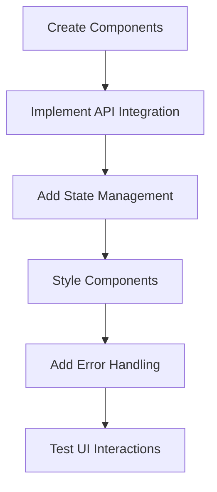
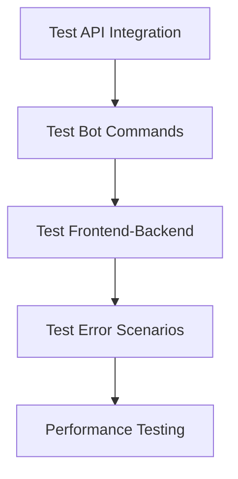
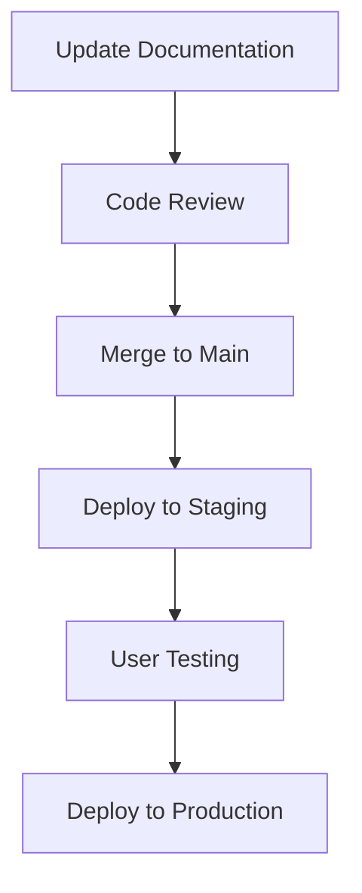

# Feature Development Workflow

## Overview
Workflow untuk mengembangkan fitur baru pada aplikasi bot telegram.

## Workflow Steps

### 1. Planning Phase


**Actions:**
- [ ] Analyze feature requirements
- [ ] Identify affected components (Frontend/Backend/Bot)
- [ ] Design database schema changes
- [ ] Plan API endpoints
- [ ] Design UI mockups
- [ ] Estimate development time

### 2. Backend Development


**Actions:**
- [ ] Create feature branch: `feature/[feature-name]`
- [ ] Update `schema.prisma` if needed
- [ ] Run `npx prisma migrate dev`
- [ ] Create service class in `src/[module]/[feature].service.ts`
- [ ] Implement business logic with proper error handling
- [ ] Create controller in `src/[module]/[feature].controller.ts`
- [ ] Add DTO classes for validation
- [ ] Write unit tests
- [ ] Test endpoints with Postman/Thunder Client

### 3. Bot Integration (if applicable)


**Actions:**
- [ ] Create bot service in `src/telegram/features/[feature].service.ts`
- [ ] Define bot commands and handlers
- [ ] Implement state management for user sessions
- [ ] Add proper error handling and user feedback
- [ ] Test bot commands manually
- [ ] Update help messages and documentation

### 4. Frontend Development


**Actions:**
- [ ] Create React components in `src/components/`
- [ ] Create page components in `src/pages/`
- [ ] Implement API service functions
- [ ] Add state management (useState/useEffect)
- [ ] Style components with Tailwind CSS
- [ ] Add error handling and loading states
- [ ] Test UI interactions

### 5. Integration Testing


**Actions:**
- [ ] Test API endpoints with real data
- [ ] Test bot commands end-to-end
- [ ] Test frontend-backend integration
- [ ] Test error scenarios and edge cases
- [ ] Check performance and optimize if needed

### 6. Documentation & Deployment


**Actions:**
- [ ] Update API documentation
- [ ] Update user documentation
- [ ] Create pull request
- [ ] Code review and approval
- [ ] Merge to main branch
- [ ] Deploy to staging environment
- [ ] Conduct user testing
- [ ] Deploy to production

## Checklist Template

### Pre-Development
- [ ] Requirements clearly defined
- [ ] Database schema designed
- [ ] API endpoints planned
- [ ] UI mockups created

### Backend Development
- [ ] Prisma schema updated
- [ ] Migration created and tested
- [ ] Service class implemented
- [ ] Controller created with proper validation
- [ ] Unit tests written and passing
- [ ] API endpoints tested

### Bot Development (if applicable)
- [ ] Bot service implemented
- [ ] Commands defined and working
- [ ] State management implemented
- [ ] Error handling added
- [ ] Help messages updated

### Frontend Development
- [ ] Components created
- [ ] API integration implemented
- [ ] State management added
- [ ] Styling completed
- [ ] Error handling implemented
- [ ] UI tested

### Testing & Quality
- [ ] Unit tests passing
- [ ] Integration tests passing
- [ ] Code review completed
- [ ] Documentation updated
- [ ] Performance acceptable

### Deployment
- [ ] Staging deployment successful
- [ ] User testing completed
- [ ] Production deployment successful
- [ ] Monitoring in place

## Common Patterns

### 1. Service Class Pattern
```typescript
@Injectable()
export class FeatureService {
  private readonly logger = new Logger(FeatureService.name);
  
  constructor(private prisma: PrismaService) {}
  
  async createFeature(data: CreateFeatureDto): Promise<Feature> {
    try {
      return await this.prisma.feature.create({ data });
    } catch (error) {
      this.logger.error('Failed to create feature', error);
      throw error;
    }
  }
}
```

### 2. Controller Pattern
```typescript
@Controller('features')
@UseGuards(JwtAuthGuard)
export class FeatureController {
  constructor(private featureService: FeatureService) {}
  
  @Post()
  async create(@Body() createFeatureDto: CreateFeatureDto) {
    return this.featureService.createFeature(createFeatureDto);
  }
}
```

### 3. Bot Service Pattern
```typescript
@Injectable()
export class BotFeatureService {
  private userStates = new Map<string, UserState>();
  
  async handleCommand(telegramId: string, command: string): Promise<string> {
    try {
      // Handle bot command logic
      return 'Success message';
    } catch (error) {
      this.logger.error('Bot command failed', error);
      return 'Error message for user';
    }
  }
}
```

### 4. React Component Pattern
```typescript
export const FeatureComponent: React.FC = () => {
  const [data, setData] = useState(null);
  const [loading, setLoading] = useState(false);
  const { toast } = useToast();
  
  useEffect(() => {
    fetchData();
  }, []);
  
  const fetchData = async () => {
    try {
      setLoading(true);
      const result = await api.getFeatures();
      setData(result);
    } catch (error) {
      toast({
        title: "Error",
        description: "Failed to fetch data",
        variant: "destructive",
      });
    } finally {
      setLoading(false);
    }
  };
  
  return (
    <div>
      {/* Component JSX */}
    </div>
  );
};
```

## Best Practices

### 1. Error Handling
- Always wrap async operations in try-catch
- Log errors with context information
- Return user-friendly error messages
- Use proper HTTP status codes

### 2. Validation
- Validate all inputs using DTOs
- Sanitize user data
- Check permissions and authorization
- Validate business rules

### 3. Testing
- Write unit tests for all services
- Test error scenarios
- Mock external dependencies
- Test API endpoints

### 4. Performance
- Use database indexes appropriately
- Implement pagination for large datasets
- Cache frequently accessed data
- Optimize database queries

### 5. Security
- Validate and sanitize all inputs
- Use proper authentication and authorization
- Implement rate limiting
- Log security events
