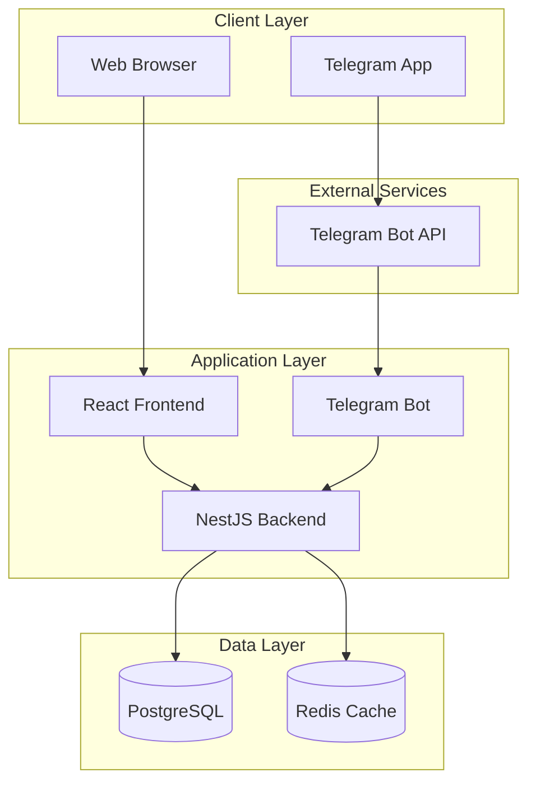
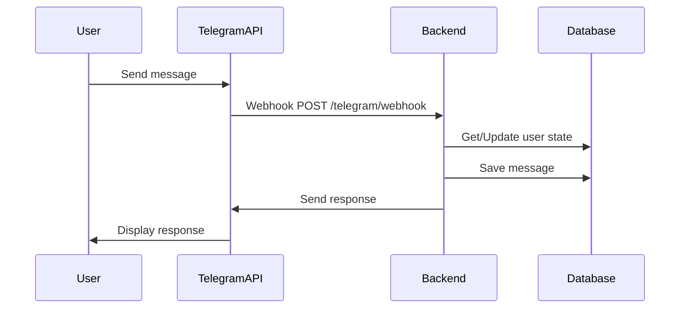
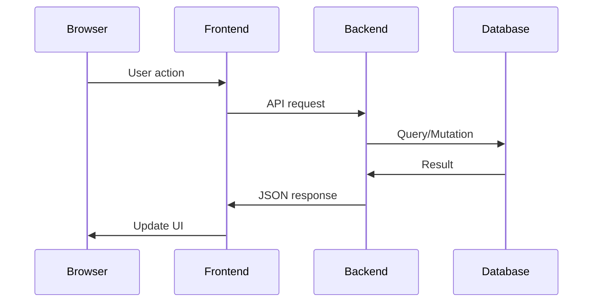
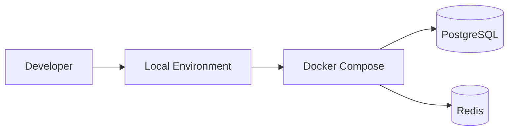
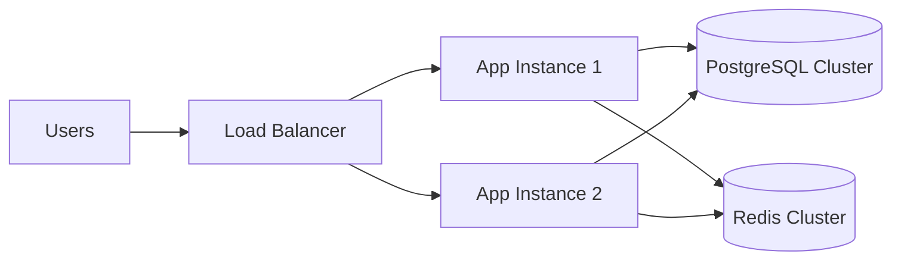

# Architecture Documentation

## Overview

Telegram Bot Web Application adalah aplikasi full-stack yang mengintegrasikan bot Telegram dengan web interface untuk manajemen dan administrasi. Aplikasi ini dibangun dengan arsitektur monorepo yang memisahkan concerns dengan jelas.

## System Architecture



## Technology Stack

### Frontend
- **React 18** - UI library
- **Vite** - Build tool dan dev server
- **TypeScript** - Type safety
- **Tailwind CSS** - Styling framework
- **React Query** - Data fetching dan caching
- **React Router** - Client-side routing
- **Zustand** - State management

### Backend
- **NestJS** - Node.js framework
- **TypeScript** - Type safety
- **Prisma** - ORM dan database toolkit
- **PostgreSQL** - Primary database
- **Redis** - Caching dan session storage
- **JWT** - Authentication
- **Swagger** - API documentation
- **Winston** - Logging

### Infrastructure
- **Docker** - Containerization
- **Docker Compose** - Local development
- **npm Workspaces** - Monorepo management

## Project Structure

```
telegram-bot-web-app/
├── apps/
│   ├── backend/              # NestJS API Server
│   │   ├── src/
│   │   │   ├── auth/         # Authentication module
│   │   │   ├── users/        # User management
│   │   │   ├── telegram/     # Telegram webhook handler
│   │   │   ├── bot/          # Bot logic dan commands
│   │   │   ├── admin/        # Admin panel API
│   │   │   ├── prisma/       # Database service
│   │   │   ├── redis/        # Cache service
│   │   │   └── logger/       # Logging service
│   │   ├── prisma/           # Database schema
│   │   └── test/             # Tests
│   └── frontend/             # React Web App
│       ├── src/
│       │   ├── components/   # Reusable components
│       │   ├── pages/        # Page components
│       │   ├── hooks/        # Custom hooks
│       │   ├── services/     # API services
│       │   ├── store/        # State management
│       │   └── utils/        # Utilities
│       └── public/           # Static assets
├── packages/
│   └── shared/               # Shared types dan utilities
│       ├── src/
│       │   ├── types/        # TypeScript interfaces
│       │   └── utils/        # Shared utilities
│       └── dist/             # Built package
├── .cline/                   # Cline automation
│   ├── rules.md              # Development rules
│   ├── workflows/            # Automated workflows
│   └── templates/            # Code templates
├── docs/                     # Documentation
├── scripts/                  # Build dan deployment
└── docker/                   # Docker configurations
```

## Data Flow

### 1. Telegram Bot Interaction


### 2. Web Application Flow


## Core Modules

### Authentication & Authorization
- JWT-based authentication
- Role-based access control (RBAC)
- Session management dengan Redis
- Password hashing dengan bcrypt

### Bot State Management
- Finite state machine untuk bot interactions
- Context-aware command handling
- User session persistence
- Multi-step conversation flows

### User Management
- User registration dan profile management
- Feature access control
- Activity tracking
- Admin user management

### Telegram Integration
- Webhook handling untuk real-time updates
- Command parsing dan routing
- Message type handling (text, photo, document, location)
- Inline keyboard support

## Security Considerations

### API Security
- Rate limiting untuk mencegah abuse
- Input validation dengan Zod schemas
- CORS configuration
- Helmet untuk security headers
- Environment variable protection

### Database Security
- Parameterized queries (Prisma ORM)
- Connection pooling
- Migration management
- Backup strategies

### Authentication Security
- JWT token expiration
- Refresh token rotation
- Password complexity requirements
- Session invalidation

## Performance Optimization

### Caching Strategy
- Redis untuk session storage
- API response caching
- Database query optimization
- Static asset caching

### Database Optimization
- Proper indexing strategy
- Connection pooling
- Query optimization
- Pagination implementation

### Frontend Optimization
- Code splitting
- Lazy loading
- Bundle optimization
- Image optimization

## Monitoring & Logging

### Application Monitoring
- Health check endpoints
- Performance metrics
- Error tracking
- User activity monitoring

### Logging Strategy
- Structured logging dengan Winston
- Log levels (error, warn, info, debug)
- Request/response logging
- Database query logging

## Deployment Architecture

### Development Environment


### Production Environment


## Scalability Considerations

### Horizontal Scaling
- Stateless application design
- Load balancer configuration
- Database clustering
- Redis clustering

### Vertical Scaling
- Resource monitoring
- Performance profiling
- Bottleneck identification
- Capacity planning

## Future Enhancements

### Planned Features
- Real-time notifications
- File upload handling
- Advanced analytics
- Multi-language support
- Plugin architecture

### Technical Improvements
- GraphQL API
- Microservices architecture
- Event-driven architecture
- Advanced caching strategies
- CI/CD pipeline

## Development Guidelines

### Code Organization
- Feature-based module structure
- Separation of concerns
- Dependency injection
- Interface segregation

### Testing Strategy
- Unit tests untuk business logic
- Integration tests untuk API endpoints
- E2E tests untuk critical user flows
- Test coverage monitoring

### Code Quality
- TypeScript strict mode
- ESLint configuration
- Prettier formatting
- Pre-commit hooks
- Code review process

## Troubleshooting

### Common Issues
- Database connection problems
- Telegram webhook configuration
- Environment variable setup
- Port conflicts
- Permission issues

### Debugging Tools
- Application logs
- Database query logs
- Network monitoring
- Performance profiling
- Error tracking

## References

- [NestJS Documentation](https://docs.nestjs.com/)
- [React Documentation](https://react.dev/)
- [Prisma Documentation](https://www.prisma.io/docs)
- [Telegram Bot API](https://core.telegram.org/bots/api)
- [Docker Documentation](https://docs.docker.com/)
